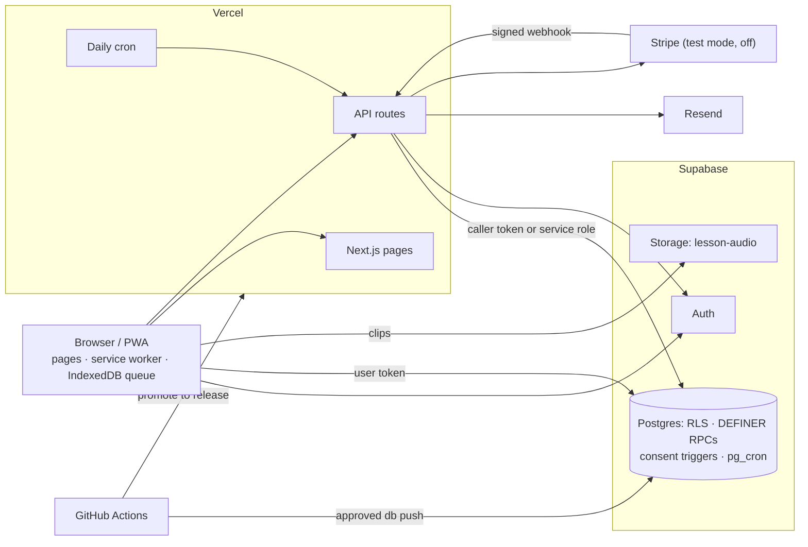

# How Radlic works

Radlic is adaptive maths for Kindergarten to Grade 8, by Radlor Inc. This is the system as the code builds it today:
what runs where, who can reach what, and which check holds it. Start at [START-HERE.md](START-HERE.md); reasons are in
[decisions.md](decisions.md).

## 1. Overview

One Next.js app on Vercel. Most pages are client components that call Supabase directly with the anon key and the
user's token; Row Level Security (RLS) decides what that token may touch. A few API routes do what a browser must not:
create accounts and child logins, send email, answer consent links, talk to Stripe. Answers are saved on the device
and uploaded through a queue. Lesson audio is a public, read-only Storage bucket.

A green CI run on `main` lets `deploy.yml` push the commit to `release`, the branch Vercel builds for production
(`vercel.json` turns off builds of `main`); migrations follow in a separate, approved job. See
[runbooks/deploy.md](runbooks/deploy.md) and [runbooks/rollback.md](runbooks/rollback.md).

## 2. The app

### Routes (`src/app`)

| Who | Routes |
|---|---|
| Child | `/modules` (home: grade tabs; KG–2 list story chapters, 3–8 list lesson modules) · `/lesson?id=` (a lesson, then adaptive practice; [product/building-lessons.md](product/building-lessons.md)) · `/lesson?module=` · `/practice?module=` · `/game?c=` (a KG–2 story chapter) · `/play` (points; games "coming soon") |
| Adult | `/parent` (parents and teachers; `?child=`, `?class=`, `&tab=`, `?view=`) · `/parent/account` · `/parent/invites` · `/parent/plan` |
| Admin | `/admin`, `/admin/learning`, `/admin/funnel`, `/admin/login` |
| Auth | `/auth` · `/auth/confirm` (sign-up link) · `/auth/callback` (Google) · `/auth/set-password` (invite, reset) · `/auth/new-password` (child's temporary password) |
| Email links | `/consent/respond`, `/consent/withdraw`, `/email/unsubscribe` (act only on a button press) |
| Public | `/` (signed in → home, else the company site's landing page) · `/help` · `/legal/<slug>` (renders `docs/legal/*.md` at build; dark until its switch in `src/app/legal/registry.ts`) · `/llms.txt` |

`/lesson-preview` and `/ui-preview` are 404 in production. The old domain redirects to `SITE_URL` (`src/app/site.ts`)
except `/api/*`.

### API routes (`src/app/api`)

Routes call Supabase over REST, as the caller (RLS applies) or with the service-role key (only for tables no client
may write). A signed-in caller is identified by their token, checked by Supabase, never by the body. Public write
routes are rate-limited per IP (`_rateLimit.ts`).

| Route | Caller | Does |
|---|---|---|
| `POST /api/auth/signup` | anyone; one email per address per 2 min | Account via Supabase's admin `generate_link` (Supabase sends nothing); needs the 18+ tick; B0 to a parent, B0t to a teacher |
| `POST /api/consent/request` | signed-in adult | Pending account consent on the current notice; B1 |
| `POST /api/consent/respond` | a link token, no session | `lookup`, `grant` (B3 scheduled first), `decline`, `withdraw` |
| `POST /api/consent/child-blocked` | caller who can see the child | B1 to a refused child's adult, unless a request is open or granted |
| `GET/POST /api/consent/cancel-second-notice` | anyone (rate-limited); daily cron | Cancels queued B3s (reads nothing from the request); with `CRON_SECRET`, the ops digest |
| `GET/POST/DELETE /api/child-login` | the learner's creator | A child's username and password (service role for Auth admin and the `self` row) |
| `GET /api/admin/metrics` | admin (own token forwarded) | One `admin_*` aggregate RPC; non-admins get 404; small buckets suppressed (`ADMIN_MIN_COHORT`) |
| `POST /api/report-error` | anyone; capped | Crash reports: log, `error_events`, `MONITORING_INGEST_URL` if set |
| `POST /api/email/unsubscribe` | an unsubscribe token | Commercial-email opt-out |
| `/api/checkout`, `/api/billing/cancel`, `/api/stripe/webhook` | parent, parent, Stripe | §8 |
| `GET /api/health` | anyone | Liveness, no database call |

### Layers (`src`)

`core/` pure domain · `data/` Supabase client, auth adapter, repositories · `features/` slices (`lessons`,
`chapters`, `consent`, `dashboard`, `classes`, `billing`, `admin`, `ops`) · `infra/` browser plumbing (IndexedDB
`kv`, upload queue, voice player, error sink) · `shared/` UI kit. Only `core/` is enforced: `layering.test.ts` fails
if it imports outside `core/` or imports React.

### Service worker and headers

`public/sw.js` ignores non-GET, `/api/*` and Supabase requests except audio clips. Navigations are network-first,
falling back to a cached copy or `/offline.html`; the only offline promise is that answers are kept (§7). Static
chunks, images and fonts are cache-first. Clips, matched by content-hash name, go to `milo-assets-audio`, which
survives releases and keeps the newest `AUDIO_CAP` (`swTakeover`, `swAudioCache`, `swPartialResponse`).

`next.config.ts` sends `X-Frame-Options: DENY`, `nosniff`, a strict `Referrer-Policy`, HSTS, a `Permissions-Policy`
with camera, microphone and geolocation off, and a CSP defaulting to `'self'` that refuses framing and plugins and
limits `connect-src`/`media-src` to the Supabase project and the audio origin. Fonts are self-hosted.

## 3. Accounts and roles

Everyone is a Supabase Auth user. Screen guards (`RoleGate`) choose what to show; RLS decides what a token reaches.

- **Parents** sign up with email and password or with Google. A Google account ticks "I'm 18 or older" and picks
  Parent or Teacher on its first visit to `/parent`. `profiles` is created on email confirmation (`handle_new_user`);
  `profiles.role` is a label its owner can write and grants nothing.
- **Teachers** sign up the same way (B0t), make classes (`grades`), pick modules and write class exercises
  (`teacher_plans.paid` decides modules vs exercises only). Adding students is paused on screen while the consent gate
  is live, as there is no school consent route yet (`rosterPaused.test.ts`).
- **Children** have no real email. The learner's creator sets a username and password via `/api/child-login`: an Auth
  user at a reserved `.invalid` address (`src/core/childLogin.ts`) plus a `learner_access` row with
  `access_role = 'self'`. The child signs in on `/auth` with the username and reaches only their own record. A
  temporary password sends them to `/auth/new-password` first.
- **Other adults** see a child through an invite (`learner_invites` → a `viewer` row), removable by the creator or the
  viewer.
- **Admin** is an account listed in `admin_users` (no client access; rows added by hand). Every `admin_*` RPC starts
  with `admin_assert()`; `/admin` shows aggregates and writes nothing.
- **Parent PIN.** Every `/parent` screen asks a 4-digit PIN (`ParentPinGate`) so a child on a signed-in device stays
  out; `parent_pins` has no client access, and DEFINER RPCs apply lockouts and a delayed reset. It guards screens, not
  data.

## 4. Supabase

### Tables

The base comes from `supabase/schema/baseline_schema.sql`, the rest from `supabase/migrations/*.sql`. RLS is on for
every table in `public`.

| Purpose | Tables |
|---|---|
| Accounts | `profiles`, `auth_events`, `admin_users`, `parent_pins` |
| Children | `learners` (name, avatar, age band, class, chosen lessons, consent, attestation), `learner_access` (owner, viewer, self), `learner_invites` |
| Learning | `lesson_progress` (per topic, or `c:<chapter>`: done, level, streak, mastered, practice position), `point_events`, `game_settings` |
| Classes | `grades` (a class), `grade_chapters`, `teacher_plans`, `exercise_results`, `lesson_feedback` |
| Consent, email | `parental_consents`, `consent_notice_versions`, `consent_b3_cancellations`, `email_suppressions` |
| Telemetry, audit | `learner_events` (story chapters), `error_events`, `deletion_log` (ids and counts only) |
| Billing (off) | `subscriptions`, `subscription_seats`, `billing_events`, `billing_config` |
| Legacy | `sessions`, `learner_progress`, `learner_stats`, `learner_state`, `diagnostic_*`, `diagnostic_leads`, `chapters` — no live writer; still read by the dashboard's fallback RPC and the export |

Age bands map to grades: `3-5` Kindergarten, `6-8` Grades 1–2, `9-11` Grades 3–5, `12-14` Grades 6–8.

### RLS model

- Access to a child is a `learner_access` row with `parent_id = auth.uid()` (owner, viewer, or the child's login);
  child-table policies read it. Only the creator writes a `learners` row.
- Progress tables are read-only to clients; DEFINER RPCs write them and compute points
  ([product/points.md](product/points.md)).
- No client access: `admin_users`, `parent_pins`, `deletion_log`, `email_suppressions`, `consent_b3_cancellations`,
  `error_events`, `lesson_catalog` (the ids that may earn progress and points; read only by the two point functions). A parent reads only their own `parental_consents` rows and writes none.
- Privilege is never read from a column its owner can write (admin is `admin_users`, not `profiles.role`). Some rules
  are column grants (invite status, `lesson_feedback`).

### SECURITY DEFINER functions

These run as their owner, so RLS does not apply inside. Each pins `search_path`, revokes EXECUTE from `public` and
`anon` and grants it only to its caller's role; those a client can call check ownership against `auth.uid()`
(`securityDefinerDrift.test.ts` fails on an undeclared change).

- **Signed-in users:** `record_lesson_progress`, `record_module_practice`, `save_practice_run`, `game_wallet`,
  `set_game_settings`, `start_game_time` (unused while `/play` spends nothing); `delete_learner`, `delete_my_account`,
  `withdraw_my_consent`, `export_child_records`; the four parent-PIN RPCs; `reassign_learner_seat`,
  `is_chapter_entitled`, `entitled_chapters`; `admin_overview/learning/funnel/activation` (behind `admin_assert`).
- **Service role only:** `consent_request`, `consent_request_at_signup`, `consent_record_request_sent`,
  `consent_lookup`, `consent_grant`, `consent_decline`, `consent_withdraw`, `consent_ok`, `consent_expire_stale`,
  `materialize_seats`, `ops_digest`. **No role:** `delete_child_data`, `consent_withdraw_account` (called by other
  functions).
- **Policy helpers and triggers:** `is_learner_creator`, `can_self_grant_access`, and the triggers for new users, new
  learners, caps, the consent gate (§5) and B3 cancellation.
- Legacy `sync_session`, `sync_diagnostic`, `sync_recheck`, `start_diagnostic` are defined; the app calls none.

### Scheduled jobs (pg_cron, UTC, as defined in the migrations)

`purge-old-learner-events` 03:17 (90 days, counted into `deletion_log`) · `prune-diagnostic-items` 03:22 (90 days) ·
`prune-error-events` 03:27 (90 days) · `prune-diagnostic-leads` 03:32 (24 months) · `prune-unconfirmed-users` 03:37
(unconfirmed after 3 days, with no children and no consent on record) · `expire-parental-consents`
03:41 (unanswered requests after 7 days). The promises are in
[legal/04-data-retention-policy.md](legal/04-data-retention-policy.md); `legalDocs.test.ts` checks the policy's
period against its job.

### Migrations

Applied in filename order on the baseline; CI and the tests rebuild the database that way. Production changes only
through `deploy.yml`'s `migrate-prod`: a person approves the `production-db` environment, the project ref is checked
against a literal (`scripts/assert-prod-ref.sh`), an encrypted backup is taken, then `supabase db push`. The app
deploys first, so the client tolerates both database shapes. See [runbooks/migrations.md](runbooks/migrations.md).

## 5. The consent gate

A child's data is collected only with verifiable parental consent (email-plus). The words are in
[legal/02-coppa-direct-notice-to-parents.md](legal/02-coppa-direct-notice-to-parents.md) and
[legal/03-consent-and-checkout-screen-copy.md](legal/03-consent-and-checkout-screen-copy.md); this is the mechanism.

- **Once per account, attested per child.** A parent consents once; each later child carries the parent's tick
  ("I'm this child's parent or legal guardian…"), stamped on `learners` with who, when and which notice.
- **The record.** `parental_consents` holds the state (`pending`, `granted`, `declined`, `withdrawn`, `expired`) and
  the notice, privacy and terms versions seen (the last two as a hash of their `docs/legal` text). Link tokens are 32
  random bytes, stored hashed, carried in the URL fragment and acted on only by POST; an unanswered request expires
  after 7 days. No grant until the email address is confirmed.
- **Notice versions.** `consent_notice_versions` (sequence, `reconsent_required`; `consent_is_current()`). Notice-v7
  is the first to name Kindergarten and Grades 1–2 (`notice_names_band()`). Grade 3–8 children under older consents
  are unaffected; a KG–2 child whose parent agreed only to an older notice is refused until the parent agrees to v7,
  and `consent_grant` then moves the account's children to it. New sign-ups and new children use v7.
- **Triggers, not RLS**, since the DEFINER functions that write most child data bypass RLS. `enforce_learner_consent`
  refuses a `learners` write unless `consent_id` is the creator's granted, current account consent, the attestation's
  notice is that version or newer, and it names the child's band. `enforce_child_consent` runs before insert or update
  on every `public` table with `learner_id` (except `learner_access`, `learner_invites`, `parental_consents`,
  `subscription_seats`) and raises `P0C01` unless `consent_ok(learner_id)`. Deletes are never gated.
  `parentalConsent.test.ts` derives the table list from the schema, so a new child table without the trigger fails.
- **A refused child.** A `P0C01` answer is marked `blocked` and waits on the device (`classifySyncError`); the child
  sees a friendly "ask a grown-up" screen (`ConsentPause.tsx`), and `/api/consent/child-blocked` emails B1 to the
  adult who added them. After the grant the answers upload.
- **Withdrawal and deletion.** Withdrawing (B3 link, or Account → Withdraw) runs `delete_child_data` for each child:
  the `learners` row cascades to every child table, the child's login goes, a `deletion_log` row is written. The
  consent is kept, marked `withdrawn`; the account stays. `delete_learner` does this for one child.
  `delete_my_account` needs a sign-in in the last 10 minutes and the email typed out; the consent record is kept and
  names no account. Survivors are declared in `src/core/accountDeletion.ts`.

| Email | When | Route |
|---|---|---|
| B0 | parent email+password sign-up: confirms the address and opens the consent page | `/api/auth/signup` |
| B0t | teacher sign-up: confirmation only | `/api/auth/signup` |
| B1 | a parent asks from the dashboard (Google, re-asking), or a refused child's adult is asked | `/api/consent/request`, `/api/consent/child-blocked` |
| B3 | scheduled at the grant for a day later (`CONSENT_SECOND_NOTICE_DELAY_MINUTES`, 24–48 h), with the withdraw link | `/api/consent/respond` |

`features/consent/server.ts` sends them through Resend's HTTP API. If a consent ends before its B3 goes out, a trigger
queues the cancellation (`consent_b3_cancellations`) in the same transaction; the respond route, the dashboard after a
deletion, and the daily cron drain it.

## 6. Lesson audio

- **Bucket.** `lesson-audio`: public, MP3 only, 256 KB per file, no policy on `storage.objects` — anyone can read an
  exact URL; clients are refused list, upload, overwrite and delete. The migration refuses to apply if a policy could
  reach it.
- **Names.** `<first 16 hex of the clip's SHA-256>.mp3`, cached a year `immutable`; a re-recorded clip gets a new
  name. Uploads: the manual `upload-audio` workflow ([runbooks/audio-upload.md](runbooks/audio-upload.md)).
- **Base.** `AUDIO_BASE` (`src/core/audioBase.ts`) is `NEXT_PUBLIC_AUDIO_BASE_URL`, else the bucket under
  `NEXT_PUBLIC_SUPABASE_URL`; the CSP reads it too, so a move is a re-upload plus one variable.
- **Lookup.** A clip is found by `clipKey` (32-bit) and must match `clipCheck` (53-bit), independent hashes of the
  line (`src/core/voiceClips.ts`). A run-time line with a child's name can collide on the short key; with both it finds
  nothing and requests nothing. A clip URL is the base plus the object name only (`noChildDataInAudioUrl.test.ts`).
- **Indexes.** One small index per lesson module and per story chapter (`features/*/voice-index/`), loaded when its
  screen mounts.
- **KG–2 questions.** Some lines depend on what the child tapped, so `openQuestion()` (`infra/voiceClipPlayer.ts`)
  fetches every line a question can lead to when it loads; while it is open, other lines use the device voice and
  request nothing (`questionLock`, `kg2IdenticalRequests`). The one bounded exception is documented at `_onTap`.
- **Fallback.** Any miss goes to `speechSynthesis`, limited to on-device voices (`speechLocalVoiceOnly.test.ts`).
  Voice rules: [product/voice.md](product/voice.md).

## 7. Child data, end to end

| Step | Tables | Route or RPC | Tests |
|---|---|---|---|
| Sign-up | `auth.users`, `profiles`, `parental_consents` | `/api/auth/signup` → `/auth/confirm` → `/consent/respond` | `signupEmailCooldown`, `signupRepeatPassword`, `signupConfirmPage` |
| Consent | `parental_consents` | `/api/consent/respond` → `consent_grant` | `consentFlow`, `consentRoutes`, `consentNeedsConfirmedEmail` |
| Add a child | `learners` (+ owner `learner_access`, `learner_stats` by trigger) | `createLearner` in the browser | `consentOnceScreens`, `consentOnceGate`, `attestationVersion` |
| Child login | `auth.users`, `learner_access`, `profiles` | `/api/child-login` | `childLogin`, `rosterRollbackDelete` |
| Lesson, practice, chapter | device, then `lesson_progress`, `point_events` | queue → the progress RPCs (§4) | `lessonSync`, `lessonSyncOwner`, `practiceRun`, `staleDeviceProgress` |
| Dashboard | `get_parent_dashboard` (INVOKER), `lesson_progress`, `point_events`, `game_wallet`; teachers `grades`, `exercise_results` | client reads, `GET /api/child-login` | `parentDashboardReads` |
| Export | every child table, crash records, access list | `export_child_records` + reads | `exportCompleteness`, `withdrawExportE2e` |
| Delete a child | `learners` cascade, child login, `deletion_log` | `delete_learner` | `consentDeletion`, `deletionAuditTrail`, `b3Cancel` |
| Close account | all children, the account; consent kept | `delete_my_account` | `accountDeletion`, `keepConsentRecord` |
| Withdraw | all children | `withdraw_my_consent`, `consent_withdraw` | `withdrawalScope`, `b3CancelWiring` |

Tests are `src/__tests__/<name>.test.ts`; parent requests follow [runbooks/data-requests.md](runbooks/data-requests.md).

**The upload queue** (`infra/storage/lessonSync.ts`, IndexedDB `milo`/`kv`) holds each answer with the account that
queued it, sends it only while that account is signed in, in order per learner, and flushes on each new item, page
load and reconnect. The database keeps the most recently answered standing, so a stale device cannot roll progress
back. Sign-out removes the children's progress copies unless an upload is waiting.

**Every place child data is written**

| Table | Written by | Read by |
|---|---|---|
| `learners` | the creating adult; `delete_child_data` | the child's adults and login; consent routes (name) |
| `learner_access` | new-learner trigger, `/api/child-login`, invite acceptance | RLS policies, `/api/child-login` |
| `lesson_progress`, `point_events` | the three progress RPCs | device, dashboard, `game_wallet`, export, `admin_activation` |
| `game_settings` | `set_game_settings` | `game_wallet`, export |
| `learner_events` | `track()` in a story chapter | export, admin aggregates |
| `exercise_results` | the child's login | teacher, child, export |
| `lesson_feedback` | "Didn't get it?" | export |
| `error_events` | `errorSink` (service role) | `export_child_records`, `ops_digest` counts |
| `parental_consents` | consent RPCs (service role) | the parent, consent routes |
| `auth.users`, `profiles` (child) | `/api/child-login` | Supabase Auth |
| `deletion_log` | deletion functions, retention jobs | service role |
| Device storage | progress copies, queues, preferences | that device ([legal/08-cookie-and-tracking-notice.md](legal/08-cookie-and-tracking-notice.md)) |

## 8. Billing

Built and switched off; nothing has been charged.

- **Schema:** `subscriptions` (one per account), `subscription_seats`, `billing_events` (an allow-listed summary per
  Stripe event), `billing_config.enforced`. Parents read their own rows; no client writes them directly.
- **`/api/checkout`:** account from the token; requires the renewal-terms tick, whose time goes on the Stripe
  subscription's metadata with the account id.
- **`/api/stripe/webhook`:** verifies Stripe's signature on the raw body first; idempotent (`stripe_event_id` unique,
  done only once `processed_at` is set); re-reads the subscription from Stripe and reconciles seats to a target
  (`materialize_seats`), so delivery order does not matter.
- **`/api/billing/cancel`:** cancels the caller's own subscription at period end. **Entitlement**
  (`is_chapter_entitled`) answers only for a learner the caller can reach; `/game` asks it once the paywall is on.
- **Off:** `src/infra/stripe.ts` refuses non-test keys; `BILLING_LIVE = false` (`src/app/legal/registry.ts`) shows
  "free during the beta"; `PAYWALL_ENABLED = false` (`useChapterGate.ts`) lets every chapter through (`betaFree`,
  `chapterGateOff`).
- **On:** set `STRIPE_SECRET_KEY`, `STRIPE_WEBHOOK_SECRET`, `STRIPE_PRICE_MONTHLY`, `STRIPE_PRICE_ANNUAL`; flip
  `BILLING_LIVE`; to gate access, flip `PAYWALL_ENABLED` and `billing_config.enforced`. Real payments also need the
  test-key guard removed, a deliberate code change.

## 9. External services

| Service | For | Receives |
|---|---|---|
| Supabase | Postgres, Auth, Storage | all stored data, child data included; audio requests from the child's device (IP, user agent) |
| Vercel | hosting, API routes, cron | every request (IP, user agent, path); function logs, including crash reports |
| Resend | app email | the adult's address and the message (first name, token links); the ops digest (counts only); nothing about a child |
| Stripe (test, off) | checkout | account id, the parent's email or customer id, seat count, renewal-consent time; nothing about a child |
| Google | adult sign-in via Supabase Auth | the adult's Google sign-in |
| GitHub | code, CI, deploys, backups | the source; an encrypted nightly production dump (30-day artifact) |

Supabase Auth's own emails (password reset, invites) go through its dashboard SMTP setting, outside this repo. The
published list is [legal/07-subprocessors.md](legal/07-subprocessors.md).

## 10. Checks that hold the architecture

| Check | Proves |
|---|---|
| `supabase/tests/rls_regression.sql` (CI `rls-tests`) | On a database built from every migration, an attacker is refused and the owner allowed; fails if no assertion ran. The same schema runs in-process for tests (`_schema.ts`). |
| `parentalConsent`, `consentReconsent` | Every child table carries the gate, on DEFINER paths too; notice-v7 refuses and upgrades as in §5. |
| `accountDeletion`, `consentDeletion`, `deletionAuditTrail`, `exportCompleteness` | Only declared survivors outlive an account; no table keeps a deleted child; each deletion is logged; the export covers every child table or says why not. |
| `securityDefinerDrift` | DEFINER and `search_path` never change silently. |
| `security`, `cspHeader`, `adminNoServiceRole` | No raw-HTML sink in `src/`; server writes check `res.ok`; no `unsafe-eval` in production; the service-role key never reaches the browser. |
| `layering` | `core/` stays pure. |
| `renameGate` | Old names, the old domain and the mascot stay off every visible surface. |
| `legalDocs`, `legalSwitch`, `publicClaims` | Legal pages stay dark until a valid switch-on; retention matches its job; no placeholder ships; public copy promises nothing unbuilt. |
| `runbookNoProdWrites` | No runbook tells its reader to write to production by hand. |
| `docLinks` | Every link between docs resolves, and no file names a doc that is not there. |
| `deploySafety`, `migrationsPending`, `actionsPinned`, `ci.yml` | Backup before `db push`; unapplied migrations retried; Actions pinned; `release` moves only after tsc, vitest, build, audit and `rls-tests` pass. |

Restores: [runbooks/backup-restore.md](runbooks/backup-restore.md). Support: [runbooks/support.md](runbooks/support.md).

---

Written from the code at `fbf193280` on 2026-09-28. Update this file in the same PR that changes the behaviour it
describes.
