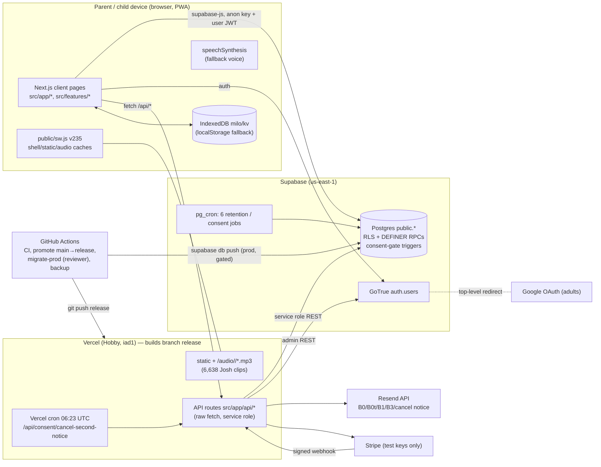
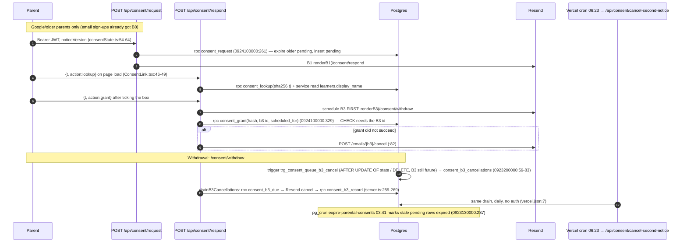
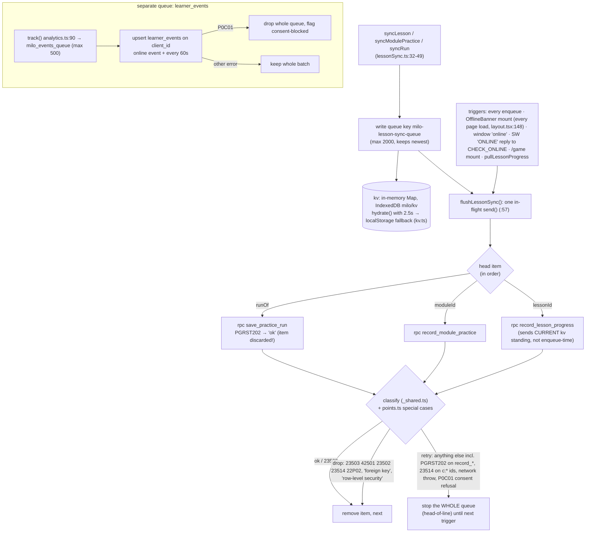
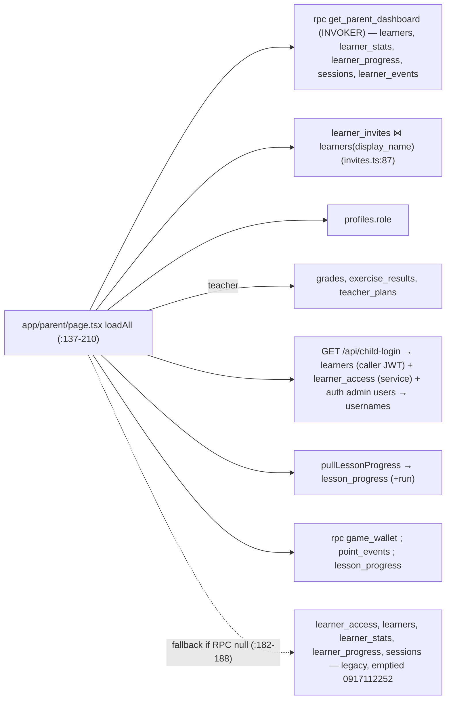
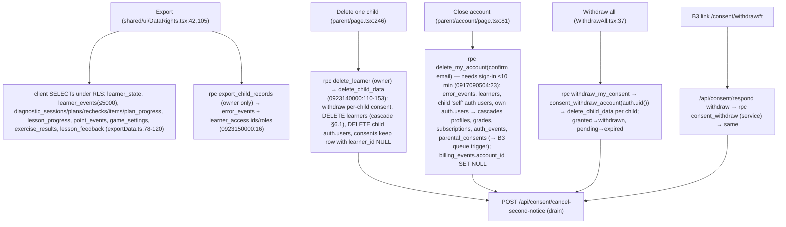

# Radlic — system map (review R0)

Repo `RadlorInc/learn` at `origin/main` `06cee602` (branch `deep-review`), read 2026-09-26. Read-only: no tracked
file was edited, production was not queried. This is the base map the other reviewers and the founder work from.

**Evidence labels (RULES.md §5).** Every claim carries one:
- **M** / Measured — I ran it: a grep with its count, a live GET, the GitHub API, a test.
- **R** / Reproduced — a scratch test in `review-scratch/map/` shows it.
- **S** / Suspected — read from source at the cited `file:line` and not demonstrated at runtime.

Most of the structure below is **S**, because it was read from code. Where two independent readers agreed (me, and a
sub-reader told to trace the same path), the claim says "cross-read". Anything about the *live* database is
S until Rafi runs `docs/review/sql/map-schema-posture.sql` (§9).

Migration citations use the file's timestamp without `2026`. For example `0923120000:330` means
`supabase/migrations/20260923120000_*.sql` line 330. `B:` means `supabase/schema/baseline_schema.sql`.

---

## 1. At a glance



Main facts, one line each:

- **Where it runs.** The app is a Next.js 16.3 App Router project (`package.json:21`). Almost every page is a client
  component. Vercel builds the `release` branch, and only `deploy.yml`'s `promote` job moves that branch, after CI
  passes (`.github/workflows/deploy.yml:39-54`, S). `vercel.json:3-7` turns off `main` deploys (M, file).
- **Database access.** The browser talks to Supabase directly: supabase-js with the anon key, a user JWT kept in
  localStorage under `milo-auth` (`src/data/supabase/client.ts`, S, cross-read), and RLS on top.
  - Every API route talks to Supabase with **raw `fetch`**. None of them uses supabase-js (M: grep for `rest/v1` and
    `auth/v1` finds 20 call sites in 7 server files).
  - Six routes use the service role: child-login, billing/cancel, stripe/webhook, and consent/* via
    `features/consent/server.ts`, plus `errorSink` behind report-error.
- **Dependencies.** There are 5 runtime dependencies (`package.json:19-26`). One of them, `zustand`, is imported
  nowhere (M: `grep -rn zustand src` finds only comments, and the same grep finds `from 'stripe'` as a control) →
  MAP-14.

---

## 2. Folder structure and each layer's job

| Path | Job | Notes |
|---|---|---|
| `src/app/` | Next routes: 42 `page.tsx`, 14 `api/**/route.ts` (M: `find`) plus `llms.txt`, `layout.tsx`, `site.ts` (canonical ids/URLs), `error`/`not-found` | Pages are thick client components (e.g. `app/parent/page.tsx` is ~1,000 lines). `app/api/_rateLimit.ts` is the shared in-memory limiter |
| `src/core/` | Pure domain: chapter registry + `LEGACY_CHAPTERS_HIDDEN = true` (`core/chapters.ts:86`), `childLogin.ts` (username ↔ synthetic email), `accountDeletion.ts` (what survives deletion), `billing.ts`, `classRoster.ts`, `progression.ts`, `voiceClips.ts` (clip key hash) | Only imports `@/core` (M) |
| `src/data/` | Supabase client singleton (`data/supabase/client.ts`), auth adapter (`data/auth.ts`), 13 repository modules (`data/repositories/*`, all `'use client'`), session hooks | **Not in the brief's list, but it is the main DB layer.** `_shared.ts` holds `db()` and `classifySyncError` |
| `src/features/` | Vertical slices: `lessons/` (9-screen player, adaptive ladders, content for 36 modules), `consent/` (server helpers, emails, copy), `dashboard/`, `classes/`, `billing/`, `admin/`, `chapters/` (hidden legacy story chapters) | `features/consent/server.ts` is **server-only** code: service-role REST + Resend |
| `src/infra/` | Cross-cutting browser plumbing: `storage/kv.ts` (IndexedDB `milo`/`kv`), `storage/lessonSync.ts` (the upload queue), `analytics.ts` (`learner_events` queue), `voiceClipPlayer.ts` + `useMiloSpeaker.ts` (clips → TTS fallback), `errorSink.ts` (server), `reportCrash.ts`, `stripe.ts` (server) | |
| `src/shared/` | UI kit (`shared/ui/*`) and generic hooks | Imports upward into `features/` (see below) |
| `supabase/migrations/` | 112 SQL files, applied in name order (M: `ls \| wc -l`) | They do **not** create the base tables. `supabase/schema/baseline_schema.sql` supplies profiles/learners/learner_access/… and CI stages it first; production never ran it (S, `ci.yml` rls-tests job) |
| `supabase/schema/` | `baseline_schema.sql`, `security_baseline.sql` (a partly stale snapshot, §8), ledger snapshot, two rollback files | |
| `supabase/tests/` | `rls_regression.sql`, `security_posture.sql`, run by `ci.yml` job `rls-tests` against a local Docker Postgres | |
| `scripts/` | 34 files: mutation tooling (`break-check.sh`, `break-verdict.mjs`), voice/Kaggle rendering (offline), sweeps, e2e drivers against a local stack (`one-email-e2e.mjs`, `consent-once-e2e.mjs`), `assert-prod-ref.sh`, `seed-staging.mjs` | None is called by the app at runtime (S) |
| `.github/workflows/` | 7 workflows, see §3.1 | |
| `public/sw.js` | Service worker, see §3.2 | |
| `public/audio/<voice>/` | Pre-rendered lesson clips + `manifest.json` | |

### 2.1 The layering rule, and what it actually enforces

`src/__tests__/layering.test.ts` makes exactly **two** assertions (S, file read in full):

1. Every file under `src/core/` imports from `@/core` only (`:62-69`).
2. No file under `src/core/` imports `react` (`:71-76`).

It enforces nothing about `data`, `infra`, `shared`, `features` or `app`. Its import regex matches only
single-quoted `from '@/…'` specifiers (`:55`). That gap happens not to matter today: there are 0 double-quoted alias
imports in `src/` (M), and `core/` has no relative imports that leave it (M).

The import graph I measured (M, `grep -rhoE "from '@/[a-zA-Z]+"` per layer) does **not** follow the dependency rule
in `docs/architecture.md` (`app → features → data → core`, "shared is a leaf"). There are 10 upward imports:

- `shared → features`, 3 imports. Example: `shared/ui/DataRights.tsx:20` imports `@/features/dashboard/i18n`.
- `infra → features`, 3 imports. Example: `infra/storage/lessonSync.ts:14` imports `@/features/lessons/adaptive`.
- `infra → app`, 2 imports (`infra/diagnostics.ts:125-126`).
- `data → features`, 2 imports (`data/repositories/grades.ts:7`, `data/supabase/useChapterSync.ts:28`).

The doc's other claim, "`data` is the only layer that talks to Supabase", is also false: 5 files outside `src/data`
call supabase-js (M): `infra/analytics.ts`, `infra/AuthEventLogger.tsx`, `features/classes/Classes.tsx`,
`features/consent/consentState.ts`, `app/api/auth/signup/route.ts`. On top of those, every API route calls
PostgREST by hand. → MAP-05.

---

## 3. Build, deploy, runtime shell

### 3.1 Workflows

| Workflow | Trigger | Does | Evidence |
|---|---|---|---|
| `ci.yml` | PR to main; called by deploy | `verify`: tsc, vitest, `next build`, `npm audit --audit-level=high`. `rls-tests`: local Supabase (CLI pinned 2.117.0), baseline + migrations, `rls_regression.sql` | S |
| `deploy.yml` | push to main | `ci` → `promote` (`git push origin HEAD:release`) → `migrate-staging` (inert unless `vars.STAGING_PROJECT_REF`) → `migrate-prod` (runs only when `migrations-changed`, environment `production-db`) | S. The environment's required reviewer is **Rafiquekuwari** (M, `gh api …/environments`) |
| `red-main.yml` | failed Deploy run on main; daily 06:37 drift check | opens an issue naming the failing half | S |
| `backup.yml` | daily 02:30 | encrypted `pg_dump` of prod → 30-day artifact | S (handoff says fixed 2026-09-23) |
| `nightly-e2e.yml`, `weekly-layout.yml` | schedule | **skip** through a `legacy-gate` job while legacy chapters are hidden | S |
| `migrate-region.yml` | manual | one-off Sydney → us-east-1 move; re-creates 4 cron jobs by hand (`:165-168`) | S |

`main` has no branch protection (M: `gh api …/branches/main/protection` → 404). That is by design: the
`release`-branch promotion is the gate (`deploy.yml:5-16`).

### 3.2 Service worker (`public/sw.js`, 211 lines, `VERSION = 'v235'`; the live `radlic.com/sw.js` is v235, M)

- Never intercepts `*.supabase.co` (`:39`) or `/api/*` (`:54`).
- A navigation to `/` goes network-only and falls back to the cached shell (`:59-70`).
- `/_next/static` is cache-first (`:73`).
- `/audio/*` is network-first for manifests and cache-first for mp3 (`:110-114`).
- Other GETs are stale-while-revalidate. An offline navigation gets `offline.html` (`:140-151`).
- The `message` handler answers `VERSION` and `CHECK_ONLINE` (`:200-211`).
- It stores **no user data**; child progress lives in IndexedDB `milo/kv` (§4.6).

### 3.3 Security headers — live equals code (M)

A GET of `radlic.com/auth` returns exactly the `next.config.ts:62-116` policy:

```
default-src 'self'; script-src 'self' 'unsafe-inline'; style-src 'self' 'unsafe-inline'; img-src 'self' data: blob:;
font-src 'self' data:; media-src 'self' data:; connect-src 'self' https://*.supabase.co wss://*.supabase.co;
worker-src 'self'; frame-ancestors 'none'; base-uri 'self'; form-action 'self' https://accounts.google.com;
object-src 'none'; upgrade-insecure-requests
```

It also sends HSTS with preload, and `Permissions-Policy: camera=(self)`. AR was deleted, so `camera=(self)` is a
leftover.

**jsDelivr and storage.googleapis.com are no longer in the CSP.** They were removed along with MediaPipe/AR.
`docs/security.md` still quotes the old, wider policy, including `wasm-unsafe-eval` → MAP-06.

Fonts come from `next/font/google` (`app/layout.tsx:2`), which downloads them at build time and self-hosts them.

---

## 4. Data flows, end to end

### 4.1 Parent sign-up (email + password; Google)

```mermaid
sequenceDiagram
  autonumber
  participant P as Parent browser
  participant SU as POST /api/auth/signup
  participant GT as Supabase GoTrue (admin)
  participant DB as Postgres
  participant RS as Resend
  participant CF as /auth/confirm (client page)
  P->>SU: {email,password,role,firstName,lang} (src/data/auth.ts:31)
  SU->>SU: rate limit 5/10min/IP (route.ts:28), validate (:30-37), requireConfig
  SU->>GT: POST /auth/v1/admin/generate_link {type:signup,email,password,data:{first_name,role}} (server.ts:114-130)
  GT-->>SU: user id, hashed_token, user_metadata (sends nothing itself)
  alt role parent (metadata.role ?? body.role, :48)
    SU->>DB: rpc consent_request_at_signup(sha256(token), ttl 7d) (:56; 0926090000:24) → parental_consents row state=pending scope=account
    SU->>RS: B0 = renderSignup(confirm?th=<hashed_token>#t=<consent token>) (:66)
    SU->>DB: rpc consent_record_request_sent(provider id) (:67)
  else teacher, or PGRST202 fallback
    SU->>RS: B0t = renderConfirm(confirm?th=…) (:71)
  end
  P->>CF: opens link (email)
  CF->>GT: supabase.auth.verifyOtp(th,'signup') (confirm/page.tsx:43) → session + email_confirmed_at
  GT->>DB: trigger on_auth_user_created → handle_new_user → profiles row (0923180000:38,54)
  CF->>DB: setMyRole(role) if profile has none — client UPDATE profiles.role under RLS (:53)
  CF->>P: redirect /consent/respond#t=<token> (parent) or home (:54)
  Note over P,GT: Google: auth/page.tsx → signInWithOAuth (data/auth.ts:122) → Google → /auth/callback → /parent → RolePicker. No B0; B1 only when the parent presses Continue on the notice (§4.2)
```

Notes on this flow:

- The consent token travels only in the URL fragment (`#t=`). The Supabase `hashed_token` is in the **query string**
  (`?th=`, `signup/route.ts:49`), so the server sees it in request logs (S) → MAP-17.
- Unconfirmed accounts with no children are deleted after 3 days by `prune-unconfirmed-users`
  (`0923180100:34-59`). The pending consent TTL is 7 days, so a B0 link opened on days 3–7 dies (S, cross-read).
- A re-POST for an unconfirmed address re-issues a link. **Whether `generate_link` replaces the password of an
  existing unconfirmed user is unmeasured** → MAP-10.

### 4.2 Consent: B1, grant, B3 at +24 h, withdrawal, backstop



- **Tokens.** Each token is 32 random bytes in base64url (`server.ts:38`). Only its sha256 is stored. Pending
  requests expire after 7 days. The same token is also the B3 withdraw link, and a granted consent never expires, so
  that link works indefinitely (S, cross-read).
- **The gate that gives consent meaning.** `enforce_child_consent` is a **BEFORE INSERT OR UPDATE trigger** on
  every table carrying `learner_id` (§6.3). It raises SQLSTATE `P0C01` (`0923120000:175-240`). It is a trigger
  and not RLS because the DEFINER RPCs bypass RLS (`0923120000:9-17`).
- **The backstop is a Vercel cron, not pg_cron** (`vercel.json:7`). The route takes no auth and no `CRON_SECRET`,
  on purpose: it can only cancel what the DB queued (`cancel-second-notice/route.ts:5-14`).

### 4.3 Add a child, and the child's username login

```mermaid
sequenceDiagram
  autonumber
  participant A as Adult browser
  participant DB as Postgres (RLS, adult JWT)
  participant CL as /api/child-login (service role)
  participant GT as GoTrue admin
  participant C as Child browser
  A->>DB: readAccountConsent: select parental_consents + rpc consent_is_current (consentState.ts:31-48)
  A->>DB: INSERT learners {display_name, avatar, grade/age_group, consent_id, attested_notice_version} (learners.ts:56-96)
  DB->>DB: BEFORE: trg_enforce_learner_cap, trg_enforce_learner_consent (P0C01 unless granted+current+own) stamps attestation
  DB->>DB: AFTER: grant_owner_access → learner_access(owner); init_learner_stats → learner_stats; trg_consent_bind_learner
  A->>CL: POST {learnerId, username, password, temporary?} + Bearer (repositories/childLogin.ts:12-35)
  CL->>GT: GET /auth/v1/user (caller) ; learners?created_by=me&id=… with CALLER's token (route.ts:51,58-63)
  CL->>GT: POST /auth/v1/admin/users {email:<u>@learner.adaptivelearn.invalid, password, email_confirm:true, user_metadata:{full_name: display_name, must_change_password}} (:148)
  CL->>DB: service INSERT learner_access{access_role:'self'} ; UPSERT profiles{role:'learner', display_name} (:157-162) — rollback deletes the auth user on failure
  C->>GT: supabase.auth.signInWithPassword(loginEmail(username)) directly from the browser (data/auth.ts:103; core/childLogin.ts:30)
  C->>DB: reads its own learner via learner_access(self) under RLS
```

- **Teacher class roster.** `Classes.tsx` `addOne` calls `createLearner` with no consent, then
  `setChildLogin(temporary=true)`. It is **paused whenever `parental_consents` is readable** (`Classes.tsx:178-190`),
  so on production today a teacher cannot add students (S) → MAP-12.
- **Child sign-in rate limits.** Nothing app-level applies, because sign-in never touches `/api/child-login`. The
  6-character minimum password is at `core/childLogin.ts`, `CHILD_MIN_PASSWORD`. See MAP-09.

### 4.4 A lesson (9 screens, voice clips)

```mermaid
flowchart TD
  L["/lesson?id=gXmY-tZ (app/lesson/page.tsx)"] --> F["findLesson (features/lessons/modules.ts)\ncontent: features/lessons/content/g*m*.ts"]
  F --> LP["LessonPlayer.tsx"]
  LP -->|setSceneVoice(lessonVoice(id)) :79| V["voiceClipPlayer.ts"]
  LP -->|prefetchClips(beats + turn + bigIdea) :82| V
  V -->|"fetch /audio/<voice>/manifest.json (no-cache) :94"| CDN["Vercel static /audio (SW: network-first manifest)"]
  V -->|"key = clipKey(text) (core/voiceClips.ts:12); audio.src=/audio/<voice>/<key>.mp3 :193"| CDN
  V -->|"any miss → speechSynthesis (useMiloSpeaker.ts; prefers localService voices :152-165, else 'Google US English')"| TTS["browser TTS"]
  LP --> S17["Screens 1–7: teach, beats say+chalk (script.ts:95-122)"]
  S17 --> S8["Screen 8: your turn — hint ×2, worked steps, twin (script.ts:223)"]
  S8 --> S9["Screen 9: sticker"]
  S9 -->|"markLessonDone (kv) + syncLesson (app/lesson/page.tsx:60)"| Q["lessonSync queue → §4.6"]
```

Lesson content is static TypeScript data, and so are the clips. The server holds no per-lesson child data except the
`lesson_progress` row (§4.5).

The **legacy `/menu` greeting speaks the child's first name** (`app/menu/page.tsx:191,193`). There is never a clip
for a name, so that line always goes to browser TTS. On a device with no local English voice, the chosen voice is
Chrome's network voice (`useMiloSpeaker.ts:167`) → MAP-04.

### 4.5 Practice, adaptive ladder, checkpoints, resume

```mermaid
sequenceDiagram
  autonumber
  participant LP as LessonPlayer / ModulePractice
  participant AD as features/lessons/adaptive.ts
  participant KV as kv (IndexedDB milo/kv)
  participant Q as lessonSync queue
  participant DB as Postgres RPCs (DEFINER, authenticated)
  LP->>AD: beginRun(id, ladder, standing, rng, review) :129 ; draw(ladder, level, r, recent) :82
  LP->>AD: advance(run, id, ladderOf, outcome) :138 → {run, pause:'checkpoint' every 5 (CHECKPOINT=5 :62) | 'mastered', saved standings}
  LP->>KV: saveRun(toSaved(run)) → milo-newflow-run-<learner>-<lesson> (LessonPlayer.tsx:98)
  LP->>Q: syncRun(learner, lesson) — at most one queued per topic (lessonSync.ts:45)
  LP->>KV: saveStanding {level,streak,mastered} (LessonPlayer.tsx:259)
  LP->>Q: syncLesson(learner, id, outcome) with a fresh event uuid
  Q->>DB: rpc save_practice_run(p_learner,p_lesson,p_run) (points.ts:59; 0925100000:44) → lesson_progress.run
  Q->>DB: rpc record_lesson_progress(p_learner,p_lesson,done,level,streak,mastered,outcome,event) (points.ts:44; 0917112109:92) → lesson_progress + point_events (points computed server-side)
  Note over LP,DB: Resume: reopening a topic reads loadRun (kv) → "Welcome back"; pullLessonProgress (lessonSync.ts:89) merges server rows (server wins unless an item is still queued). Done = mastered or DONE_AFTER=12 answers (adaptive.ts:64,122)
```

### 4.6 Progress sync and the offline queue



- **Retry timing.** Nothing retries the lesson queue on a timer while the device is online. The `useOfflineSync()`
  hook, which has the 30 s interval, is never used; only `OfflineBanner` and `flushQueue` are (S, cross-read) →
  MAP-15.
- **Consent refusals stall the lesson queue.** A `P0C01` refusal is classified `retry`, although the trigger's own
  hint says retrying will not fix it (`0923120000:193-196`). The lesson queue then stops for **every learner on the
  device**. Reproduced in `review-scratch/map/lessonSyncConsent.test.ts` (R) → MAP-03.
- **Analytics loses events.** The `learner_events` flush erases events tracked while an upsert is in flight (R,
  `review-scratch/map/analyticsFlushRace.test.ts`) → MAP-07.
- **Expand/contract fallbacks.** These are deliberate and let either deploy order work:
  - `42703` on `lesson_progress.run` re-reads without the column (`points.ts:68-70`).
  - `PGRST202` on `delete_learner` falls back to the legacy delete (`learners.ts:195`).
  - `PGRST202` on `consent_request_at_signup` falls back to B0t (`signup/route.ts:61-63`).
  - `PGRST202` on `consent_b3_due` makes the drain return null, and the direct cancel is used instead
    (`server.ts:262`).

### 4.7 Parent dashboard (reads)



Writes from the dashboard:

- `createLearner`, `setLearnerAssignments` (`learners.lesson_ids`/`lesson_due`)
- `acceptInvite` (`learner_access` upsert + `learner_invites` update)
- `delete_learner`, `removeMyselfFromLearner`
- `setMyRole`, `set_game_settings`
- the parent PIN RPCs (`parentPin.ts`)
- DELETE `/api/child-login` (all S, cross-read)

### 4.8 Export, delete child, close account, withdraw consent



Retention survivors are declared in `core/accountDeletion.ts:25-58`: `billing_events`, what Stripe holds, and
`diagnostic_leads`. The claim that `billing_events` is "stripped of who it belonged to" is contradicted by the
webhook storing the **whole Stripe event** as `payload` (`stripe/webhook/route.ts:89`) → MAP-02.

Closing the account deletes `parental_consents` by cascade (S). Doc 06 says a consent record is kept → MAP-13.

---

## 5. Every place child data is read or written

The "Consent gate" column refers to `trg_enforce_child_consent` (BEFORE INSERT/UPDATE) or, for `learners`,
`trg_enforce_learner_consent`. RLS policies are the final versions from §6.1. All entries are S unless marked.

| Where (entry point) | Table(s) | R/W | Who (DB role) | Consent gate? | Governing RLS / check |
|---|---|---|---|---|---|
| `learners.ts:85` createLearner (browser) | learners | W (insert) | authenticated (adult) | **yes** — learner trigger (+ `consent_id NOT NULL`) | "learners: insert" WC `created_by=uid` (0615142012:12) |
| AFTER triggers on learners (B:514-518) | learner_access, learner_stats | W | trigger (DEFINER) | learner_stats yes; learner_access exempt | n/a (DEFINER) |
| `learners.ts:37` / dashboard, `/menu` | learners | R | authenticated (adult, viewer, child `self`) | n/a (reads) | "learners: select" creator OR in learner_access (0615142012:7) |
| `learners.ts:105-143` setLearnerAssignments, rename | learners | W (update) | authenticated (creator only) | yes (UPDATE fires trigger) | "learners: update" `created_by=uid` |
| `points.ts:44,50` via lessonSync | lesson_progress, point_events | W | authenticated → **DEFINER** `record_lesson_progress`/`record_module_practice` (checks learner_access) | **yes** | RLS bypassed (DEFINER); read policy EXISTS learner_access (0917112109:78,81) |
| `points.ts:59` | lesson_progress.run | W | authenticated → DEFINER `save_practice_run` | **yes** (asserted 0925100000:91-93) | as above |
| `points.ts:68,79,88` | lesson_progress, point_events | R | authenticated (adult, viewer, child) | n/a | EXISTS learner_access |
| `points.ts:100,108` | game_settings (+point_events) | R/W | DEFINER `game_wallet`, `set_game_settings` (owner/creator), `start_game_time` | yes | "game_settings: read" (0917112109:84) |
| `analytics.ts:55` track() | learner_events | W (upsert) | authenticated | **yes** (P0C01 handled → drop) | insert WC learner in learner_access (0617144759:8) |
| `lessonFeedback.ts:12` "Didn't get it?" | lesson_feedback | W | authenticated | yes | "sent" creator OR learner_access; column grant (learner_id, lesson_id, screen, reasons) (0921053233:32,43) |
| `grades.ts:135` class exercise | exercise_results | W | authenticated (child `self`) | yes | INSERT WC `access_role='self'` AND open exercise (0918140000:47) |
| `grades.ts:145` | exercise_results | R | teacher (creator) / child | n/a | 0918140000:39 |
| `/api/report-error` → `errorSink.ts:75` | error_events (`learner_id` if a UUID, url, ua, stack, message) | W | **service_role** | **yes** (a crash row for an ungranted child → P0C01) | no policies (deny-all to clients) |
| `/api/child-login` | auth.users (child), learner_access(self), profiles | R/W | service_role (+ caller JWT for ownership) | learner_access exempt; profiles has no learner_id → **not gated** | ownership via `learners?created_by=me` under caller RLS |
| `/api/consent/respond` lookup | learners.display_name | R | service_role | n/a | none (service) |
| `consent/*` RPCs | parental_consents | R/W | service_role only (browser SELECT own rows) | exempt (it is the record) | "own rows" SELECT only (0923120000:330) |
| `export_child_records`, exportData.ts | 14 child tables + error_events + learner_access | R | authenticated (owner check inside RPC) | n/a | per-table RLS; RPC checks ownership |
| `delete_learner` / `delete_my_account` / `withdraw_my_consent` / `consent_withdraw` | learners (+cascade), auth.users | W (delete) | authenticated → DEFINER; service_role for the link path | deletes not gated (trigger is INSERT/UPDATE only) | ownership inside the functions |
| `get_parent_dashboard`, `get_insights_rollup`, `get_learner_bootstrap` | learners, stats, progress, sessions, learner_events, diagnostic_* | R | authenticated, **INVOKER** (RLS applies) | n/a | per-table RLS |
| `admin_overview/learning/funnel` via `/api/admin/metrics` | learners, profiles, learner_events, sessions (aggregates, `p_min_cohort` default 5) | R | authenticated caller → DEFINER + `admin_assert()` (admin_users) | n/a | deny unless in admin_users |
| Legacy (hidden chapters, fallback) `sync_session`, `sync_diagnostic`, `sync_recheck`, `start_diagnostic` | sessions, learner_progress, learner_stats, diagnostic_* | W | authenticated → DEFINER | yes | legacy **FOR ALL** policies on learner_stats/learner_state/learner_progress accept **any** learner_access row, so a viewer or a child `self` login may write them directly (0615142138:14-28) → MAP-08 |
| pg_cron `purge-old-learner-events` (03:17) | learner_events > 90 d | W (delete) | postgres | n/a | n/a |
| pg_cron `prune-error-events` (03:27), `prune-diagnostic-items` (03:22) | error_events, diagnostic_items > 90 d | W (delete) | postgres | n/a | n/a |
| Device only | IndexedDB `milo/kv`: `milo-newflow-done/standing/run-<learner>-<lesson>`, `milo-lesson-sync-queue`, `milo_events_queue`, text size, voice pref; localStorage `milo-auth` (session JWT) | R/W | the device | none | none (doc 08 describes these) |

**Not child data, but adjacent:**

- `profiles` (the adult's display_name, or the email if no `full_name`)
- `learner_invites.invited_email`
- `diagnostic_leads.email` (authenticated insert only)
- `auth_events`
- `subscriptions`, `billing_events` (parent/Stripe)
- `parental_consents.email_address`

**What needs production confirmation.** Three things:

- which tables actually carry `trg_enforce_child_consent` (the migration builds the list from the catalog at apply
  time)
- the real function ACLs
- the cron job list and its run history

All three are in `docs/review/sql/map-schema-posture.sql`, queries 1–4. The migrations imply the 14 gated tables
listed in §6.3. The rest is BLOCKED on Rafi (§9).

---

## 6. Database inventory (final state implied by the migrations)

### 6.1 Tables (all `public`, all RLS ON)

| Group | Tables | Child-identifying | Client policies |
|---|---|---|---|
| Accounts | profiles (B:80), auth_events, admin_users, parent_pins | profiles.display_name, role | profiles "own row" ALL (0615142138:4); auth_events insert own; admin_users/parent_pins deny-all |
| Children | learners (B:112), learner_access (B:128, roles owner/viewer/**self**), learner_invites (B:136) | display_name, avatar, age_group, grade_id, lesson_ids, lesson_due, consent_id NOT NULL, attestation fields | see §5; learner_invites recipient policies key on `lower(jwt email)` (0615142138:39-41) |
| New-flow progress | lesson_progress (PK learner,lesson; `run` jsonb), point_events, game_settings | learner_id | SELECT only; writes via DEFINER RPCs |
| Classes | grades (= a teacher's class), grade_chapters, teacher_plans, exercise_results, lesson_feedback | learner_id, class_id | 0918100000/0918120000/0918140000/0921053233 |
| Consent | parental_consents, consent_notice_versions, consent_b3_cancellations, email_suppressions | parental_consents.learner_id (SET NULL), email_address | parental_consents SELECT own (bare `auth.uid()`, 0923120000:330); others deny-all / read-all (versions) |
| Telemetry | learner_events, error_events | learner_id, props, url, ua, stack | learner_events insert/select via learner_access; error_events deny-all |
| Billing (inert, `PAYWALL_ENABLED = false`, `useChapterGate.ts:23`) | subscriptions, subscription_seats, billing_events, billing_config | subscription_seats.learner_id | owner read only |
| **Legacy, emptied 0917112252:19-21, still present** | sessions, learner_progress, learner_stats, learner_state, diagnostic_sessions/items/plans/plan_progress/rechecks, diagnostic_leads, chapters | learner_id | legacy FOR ALL / SELECT policies still live |

`learner_id → learners` is **ON DELETE CASCADE** on every child table, including `error_events` since
`0923140000:35`. The exceptions are `subscription_seats` and `parental_consents`, which are SET NULL, and
`learners.created_by → profiles`, which is RESTRICT (B:323).

The baseline grants ALL on its tables to anon/authenticated (B:697). RLS is the only gate on those tables. TRUNCATE
is not reachable through PostgREST.

### 6.2 Functions

Every DEFINER function pins `search_path` (S, cross-read). There are **several dozen DEFINER functions**. A crude grep finds 69 function names ever defined near `security definer`, which is an upper bound because it includes dropped ones and neighbours (M). Query 3 gives the live number. The grouped
list, with final-definition citations, was cross-read from the migrations:

- **Consent** (service_role only):
  - `consent_request`, `consent_request_at_signup`, `consent_record_request_sent`, `consent_lookup`
  - `consent_grant`, `consent_decline`, `consent_withdraw`, `consent_expire_stale`
  - `consent_b3_due` and `consent_b3_record` (INVOKER)
  - `consent_ok`
  - `delete_child_data` and `consent_withdraw_account` also revoke service_role, so they are reachable only from
    other functions.
- **Authenticated, self-guarding:**
  - progress and game: `record_lesson_progress`, `record_module_practice`, `save_practice_run`, `game_wallet`,
    `start_game_time`, `set_game_settings`
  - account and children: `delete_learner`, `delete_my_account` (needs `amr` ≤10 min), `withdraw_my_consent`,
    `export_child_records`
  - parent PIN: `parent_pin_status`, `verify_parent_pin`, `set_parent_pin`, `request_parent_pin_reset`
  - admin: `admin_*` (behind `admin_assert`)
  - legacy: `sync_session` (3 overloads), `sync_diagnostic`, `sync_recheck`, `start_diagnostic`,
    `entitle_revised_step`
  - billing: `is_chapter_entitled` and `entitled_chapters` (no caller check, a one-bit oracle, accepted in-file),
    `reassign_learner_seat`
- **Triggers (no EXECUTE):** `handle_new_user`, `grant_owner_access`, `init_learner_stats`, the caps,
  `enforce_child_consent`, `enforce_learner_consent`, `consent_bind_learner`, `consent_queue_b3_cancel`,
  `consent_guard_update` (INVOKER), `rls_auto_enable` (event trigger, only in B).
- **Cron-only:** `prune_error_events`, `prune_diagnostic_items`, `prune_diagnostic_leads`,
  `prune_unconfirmed_users`, `delete_lead_by_email`.
- **Unsure.** Supabase's default privileges also grant service_role EXECUTE unless it is explicitly revoked
  (`0825030558:83-96`). Query 3 measures the real ACLs.

### 6.3 The consent gate's coverage

The DO loop at `0923120000:293-316` attaches `trg_enforce_child_consent` to every public table with a `learner_id`
column except `learner_access`, `learner_invites`, `subscription_seats` and `parental_consents`. That gives **14
tables**:

- `sessions`, `learner_progress`, `learner_stats`, `learner_state`, `learner_events`
- `diagnostic_sessions`, `diagnostic_plans`, `diagnostic_rechecks`
- `error_events`
- `lesson_progress`, `point_events`, `game_settings`
- `exercise_results`, `lesson_feedback`

`0924100000:477-479` asserts ≥14, and `0925100000:91-93` asserts `lesson_progress` is among them.

There are gaps, all S:

- `diagnostic_items` and `diagnostic_plan_progress` have no `learner_id`, so they are not gated.
- **Any child table added later is not gated automatically.** The loop ran once, and there is no event trigger
  that re-applies it. Every new table with a `learner_id` needs its own trigger line or a re-run of the loop. None
  has been needed since (S).
- DELETEs are not gated. That is correct: deletion must always work.

### 6.4 pg_cron jobs (UTC)

| Job | Schedule | Action | Source |
|---|---|---|---|
| purge-old-learner-events | 03:17 | delete learner_events older than 90 d. The restated job dropped the original `event <> 'daily_complete'` carve-out (0617150311:15) | 0823215352:19 |
| prune-diagnostic-items | 03:22 | 90 d | 0823215352:21 |
| prune-error-events | 03:27 | 90 d | 0823215352:22 |
| prune-diagnostic-leads | 03:32 | 24 mo | 0823215352:23 |
| prune-unconfirmed-users | 03:37 | auth.users unconfirmed > 3 d with no learners | 0923180100:59 |
| expire-parental-consents | 03:41 | pending → expired past `expires_at` | 0923130000:237 |

There is **no pg_net or http** call anywhere in the migrations (S, cross-read). The B3 backstop runs on Vercel.
Not in the migrations: `point_events` and `lesson_feedback` have no retention job (S). Doc 04 is the place to check
whether that is intended.

---

## 7. External services — what each receives (from the payloads in code)

| Service | Called from | Receives | Child data? |
|---|---|---|---|
| **Supabase** (Postgres + GoTrue, us-east-1) | browser (supabase-js), API routes (raw REST) | everything in §5–6. Child logins are GoTrue users `<username>@learner.adaptivelearn.invalid` with `user_metadata.full_name = display_name` (`child-login/route.ts:149`) | **Yes**, the system of record |
| **Resend** (`https://api.resend.com`, `server.ts:135`) | `features/consent/server.ts:147-173` only | from `Radlic <noreply@radlor.com>`, reply-to `support@radlor.com` (`config.ts:43-44`); to = the parent's email; subject/html/text; `Idempotency-Key`; `scheduled_at` (B3); cancel calls `/emails/{id}/cancel` (`:237`). Five emails:<br>• **B0**: parent first name, confirm link with `?th=` + `#t=` token<br>• **B0t**: confirm link<br>• **B1**: first name, `/consent/respond#t=`<br>• **B3**: `/consent/withdraw#t=`<br>• **billing cancel notice**: period end (`billing/cancel/route.ts:73`) | **No child name in any template** (S, cross-read `email.ts:24-69`). The link tokens grant consent actions |
| Supabase Auth mailer (SMTP, possibly via Resend) | Supabase-hosted | password reset (`data/auth.ts:59`), invites, email change — hosted templates, not in the repo | No |
| **Stripe** (test keys enforced: `infra/stripe.ts:32-47` throws unless `sk_test_`) | `/api/checkout`, `/api/billing/cancel`, webhook | checkout: price id, `quantity=seats`, `client_reference_id=account uuid`, `subscription_data.metadata.account_id`, success/cancel URLs, `customer` or `customer_email` (`checkout/route.ts:88-119`). **No learner id, no names** (M: `grep -nE "learner|display_name"` over `checkout/route.ts` and `infra/stripe.ts` returns nothing, while the same files match `customer_email` as a control) | No |
| **Vercel** | hosting, functions, cron | every request (IP, path, UA); the `?th=` signup token in the query; function console logs, which include `sinkError` lines (message, url, learner_id) | Incidentally (ids, paths) |
| **Google OAuth** | top-level redirect via Supabase (`data/auth.ts:122`, scopes `email profile`) | the adult's sign-in; Google returns name/email/avatar to Supabase | No |
| **Google network TTS** (conditional) | browser `speechSynthesis` when no local English voice | the spoken line text, including the child's first name on `/menu` (`app/menu/page.tsx:191-193`) | **Possibly** → MAP-04 |
| **GitHub Actions** | `backup.yml` | the whole prod DB, encrypted, 30-day artifact | Yes, encrypted |
| **jsDelivr / storage.googleapis.com** | nothing | not in the live CSP (M) | — |
| **Kaggle / Chatterbox / ElevenLabs** | offline scripts (`scripts/kaggle-*`, `chatterbox-*`) | lesson text only. No script reads app data except the local-stack e2e drivers and `seed-staging.mjs` (M: grep for supabase/learner in `scripts/`) | No |
| `MONITORING_INGEST_URL` | `errorSink.ts` if set | crash records incl. learner_id | Would. Doc 07 says it is unset (dashboard-checked 2026-09-24; not re-measured) |

---

## 8. Where the docs and the code disagree

| Doc says | Code says | Evidence |
|---|---|---|
| `docs/legal/07-subprocessors.md:23`: Resend is only the SMTP relay; "the application contains no email code of its own" | The app calls Resend's HTTP API directly for B0/B0t/B1/B3/cancel notice, schedules and cancels sends (`features/consent/server.ts:135-173,237`) | M (grep) → MAP-01 |
| `docs/legal/07:22`: Stripe "not used during the beta… no data is sent" | `/api/checkout` is a live route and works whenever `STRIPE_SECRET_KEY` (test) + price vars are set. The UI gate is `PAYWALL_ENABLED = false`. Whether prod has the key is unknown | S, BLOCKED |
| `core/accountDeletion.ts:27-31`: `billing_events` survives deletion "stripped of who it belonged to" | `payload` holds the full Stripe event (customer email/details, client_reference_id) (`stripe/webhook/route.ts:89`) | S → MAP-02 |
| `docs/legal/06:34`: a record that permission was given and withdrawn is kept | Withdrawal keeps it; **close account** cascades it away (`parental_consents.parent_id → auth.users ON DELETE CASCADE`, 0923120000:28). Doc 04:38-40 does acknowledge this | S → MAP-13 |
| `docs/legal/09-email-compliance.md` §8: the list of every email | omits the billing cancel notice (`billing/cancel/route.ts:73`) | S (cross-read) |
| `docs/security.md` CSP section | quotes jsDelivr, storage.googleapis.com, `wasm-unsafe-eval`, `worker-src blob:`, none of which is live | M → MAP-06 |
| `docs/security.md` "all 12 DEFINER functions pin search_path"; V13 "anon insert OPEN"; the `sync_*` RPCs as the main write path | several dozen DEFINER functions (§6.2). anon INSERT on `diagnostic_leads` was revoked (0823221818:40). New-flow writes go through `record_lesson_progress`/`save_practice_run` | S → MAP-06 |
| `supabase/schema/security_baseline.sql:74,162` | parental_consents has 1 policy, not 3; leads insert is authenticated-only | S (cross-read) → MAP-06 |
| `docs/architecture.md` (layering, folder tree) | lists deleted `state/`, `skillGraph`, `diagnosticEngine`, `daily/`, `insights/`; says only `data/` touches Supabase — 5 other files do, plus every API route | M → MAP-05 |
| `docs/data-inventory.md` (measured 2026-09-05) | describes `sessions` as the activity record; that table was emptied 2026-09-17 | S |
| `AccountConsent.tsx:10-12` header ("signup tick + `auto` sends B1") | no `auto` exists; `consentState.ts:52-53` says the tick is never sent | S (sub-reader) |
| `copy.ts:211` waiting text ("choose 'I give permission'") | the control is the "I've Read and I Agree…" tick (`copy.ts:142`) | S (sub-reader), rafi (copy) |

---

## 9. Needs production confirmation (BLOCKED on Rafi)

`docs/review/sql/map-schema-posture.sql` has 8 read-only queries. What each answers is written above it in the
file.

| Query | What it measures |
|---|---|
| 1 | Per-table RLS, policy count, `has_learner_id` versus `has_consent_gate`. **Any row with `has_learner_id` true and `has_consent_gate` false is an ungated child table** |
| 2 / 2b | Every trigger, including those on `auth.users` |
| 3 | Function ACLs and owners, which checks the DEFINER count and the service_role-only claims |
| 4 / 4b | cron jobs and their last-14-day run status |
| 5 / 6 | column grants and anon table grants |
| 7 | the migration ledger compared with the repo |
| 8 | whether `pg_net`/`http` are installed |

Also not measurable from here:

- the production env var set (is `STRIPE_SECRET_KEY` present? is `MONITORING_INGEST_URL` absent?)
- Supabase Auth hosted settings: sign-in rate limits, OTP expiry, leaked-password protection on the admin route
- Vercel's Production Branch (`release`, per `deploy.yml:5`)

---

## Findings table

| ID | title | area | severity | evidence | effort | when | bucket | files |
|---|---|---|---|---|---|---|---|---|
| MAP-10 | Re-signup of an **unconfirmed** address may keep the first caller's password (pre-account-takeover) — unmeasured whether `generate_link` overwrites it | auth | High (auth; until measured) | Suspected | S (measure on a local stack) | fix now — measure first; if it keeps the old password, refuse/replace server-side | own | `src/app/api/auth/signup/route.ts:41-49`, `src/features/consent/server.ts:114-130` |
| MAP-09 | Child accounts sign in browser-direct with a guessable username namespace and a 6-char minimum; only Supabase-hosted per-IP limits apply (the app limiter never sees sign-in) | auth / child | High (child auth; until the hosted limits are measured) | Suspected | S to measure, M to fix | fix now — read the hosted rate-limit settings; consider a longer minimum or lockout | own (measure) / rafi (password rule is visible to adults) | `src/core/childLogin.ts`, `src/data/auth.ts:103`, `src/app/auth/page.tsx:127` |
| MAP-04 | The child's first name is spoken through `speechSynthesis`; with no local English voice the code picks Chrome's network "Google US English" voice, which sends the text to Google — a third party not in doc 07 | privacy / child | High (child data to a third party; conditional) | Suspected | S | fix now — only use `localService` voices for any line carrying a name (or drop the name from TTS) | own | `src/app/menu/page.tsx:191-193`, `src/infra/useMiloSpeaker.ts:152-172` |
| MAP-02 | `billing_events.payload` stores the full Stripe event (parent email, name, address), so after account deletion the row still identifies the family, against `accountDeletion.ts`'s "stripped" claim | privacy / billing | Medium (parent data; billing off in beta) | Suspected | S | before billing is switched on — store a minimal payload, or scrub on delete | own | `src/app/api/stripe/webhook/route.ts:86-90`, `src/core/accountDeletion.ts:25-31` |
| MAP-01 | Subprocessor doc says the app has no email code; it calls Resend's API directly (and schedules/cancels) | legal docs | Medium | Measured | S | fix now (published legal text) | rafi | `docs/legal/07-subprocessors.md:23`, `src/features/consent/server.ts:135-173` |
| MAP-13 | Close account cascades away the consent record; doc 06 says the record is kept | legal / consent | Medium | Suspected | S | after beta — decide keep-vs-delete, then align doc or FK | rafi | `supabase/migrations/20260923120000_parental_consent.sql:28`, `docs/legal/06-parent-rights-procedure.md:34` |
| MAP-03 | A `P0C01` consent refusal on a queued lesson upload is classified `retry`, so the device's whole upload queue (all learners) stalls forever behind it | sync | Low (narrow window: learner exists with a non-granted consent) | Reproduced | S | after beta — treat P0C01 as `drop` like analytics does | own | `src/data/repositories/_shared.ts` (classifySyncError), `src/infra/storage/lessonSync.ts:64-81`; repro `review-scratch/map/lessonSyncConsent.test.ts` |
| MAP-07 | `learner_events` flush erases events tracked while an upsert is in flight (`kv.remove` of the whole key) | analytics | Low | Reproduced | S | after beta — remove only the sent `client_id`s | own | `src/infra/analytics.ts:43-81`; repro `review-scratch/map/analyticsFlushRace.test.ts` |
| MAP-08 | Legacy tables/RPCs (sessions, learner_progress/stats/state, diagnostic_*, sync_*) are empty but live: still granted, still gated, still read by the dashboard fallback and export; their FOR ALL policies let a viewer or child `self` login write them | schema hygiene | Low | Suspected | M | after beta — drop in a migration (with export/doc updates) | own | `supabase/migrations/20260615142138_rls_initplan_perf.sql:14-28`, `20260917112252_*.sql:19-21`, `src/app/parent/page.tsx:182-188`, `src/data/repositories/exportData.ts:82-103` |
| MAP-15 | No timed retry of the lesson queue while online after a `retry` (the `useOfflineSync` hook with the interval is unused); uploads wait for the next enqueue, page load or `online` event | sync | Low | Suspected | S | later | own | `src/infra/useOfflineSync.tsx:25-80`, `src/infra/storage/lessonSync.ts:57` |
| MAP-12 | Teacher "add student" is paused whenever `parental_consents` is readable, so production teachers cannot add students | classes | Low (known legal gap: teacher consent route) | Suspected | — | rafi decision | rafi | `src/features/classes/Classes.tsx:178-190` |
| MAP-17 | The Supabase `hashed_token` (a one-time sign-in credential) rides in the confirm link's query string, so it lands in server request logs | auth | Low (Supabase's standard pattern; Hobby log retention 1 h) | Suspected | S | later — could move it to the fragment | own | `src/app/api/auth/signup/route.ts:49` |
| MAP-11 | Every rate limit is an in-memory Map per serverless instance | abuse | Low (fine at tens of families) | Suspected | M | won't fix now — revisit at ~10k families or on abuse | own | `src/app/api/_rateLimit.ts` |
| MAP-06 | `docs/security.md` and `security_baseline.sql` are stale (CSP quote, DEFINER count, V13, sync_* as the write path, policy counts) | docs | Low | Measured (CSP) / Suspected | S | after beta | own | `docs/security.md`, `supabase/schema/security_baseline.sql:74,162` |
| MAP-05 | `docs/architecture.md` is stale, and the layering test enforces only `core/` purity; 10 upward imports (shared/infra/data → features/app) and 5 non-`data` Supabase callers exist | architecture | Low | Measured | S (doc) / M (rule) | later — replace the doc with this map; widen the rule only if it can be kept green | own | `src/__tests__/layering.test.ts`, `docs/architecture.md` |
| MAP-14 | `zustand` is a runtime dependency with no import left | deps | Low | Measured | S | later | own | `package.json:25` |
